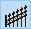

# BeeArr's Tiles & Tools

This project started as just a way to improve my personal Map-Making experience in Project Zomboid's TilZed/WordlEd/BuildingEd tools. It started with the simple goal of adding tiles to BuildingEd, but evolved into a complete new set of tools for TilZed, as well as a re-work of some existing ones, that will hopefuly make the Map-making process easier and more acessible for everyone.

I would like to thank the Unnoficial PZ Mapping Discord (https://discord.gg/Tc3qRrM3) for the support and help they have shown me.

If this project helped you, please consider supporting me on Ko-fi.

# Backup your files!

Before you change anything in your own editors, please remember to backup all of your relevant files, which include:

- Any and all files modified in this project.
- Any and all files contained within all map projects (.tmx, .pzw, .lotheader, .bin, .lotpack, etc.)
- Any and all building files (.tbx).
- Any and all tilesheets (.png).

These tools have not yet been tested fully, 

I am not responsible for any loss of data resulting from the usage of these tools. [See license.txt for more information](LICENSE)

# Watch out for Mods!

I personally like to use many mods, especially new tiles. As such most of this project requires the same mods/tilesheets to be available, the list of which can be found here. 
- I have separated the tiles used by the TileZed tools into two categories (Vanilla and Modded); it should be easy to spot and comment out the modded tiles if you prefer to make maps using only Vanilla tiles.
- When it comes to the BuildingEd ISO mode, I made no such separation, and using my modifications to that tool without the mods/tilesheets is not recommended.

# The Tools:

## TileZed - 

### Expanded Tiles:
Pertominus#5743 gave me a great deal of inspiration when he posted his personal 'tool-fence-data.lua. I have greatly expanded upon that list of fences to include all fences, both vanilla and modded (excluding the broken pieces.) As well as other non-fence tiles which work well with the tool, such as power lines, HVAC tiles, vines, etc.

###

